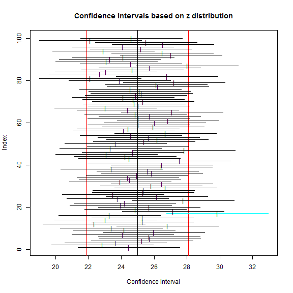
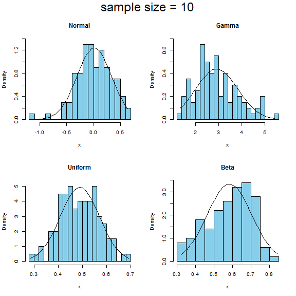
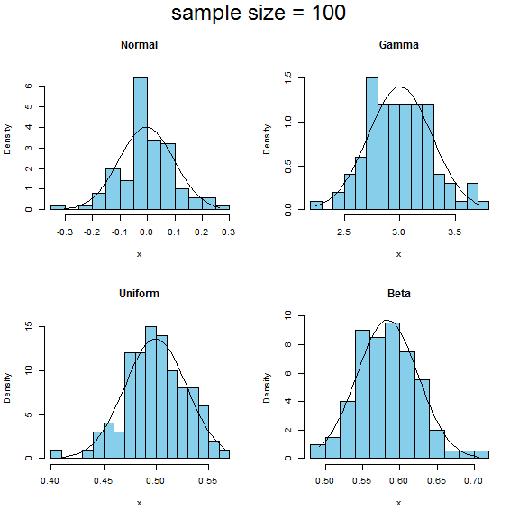
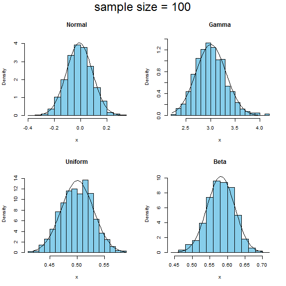

<!-- R Commander Markdown Template -->

Replace with Main Title
=======================

### Your Name

### 2018-09-26


```r
> ci.examp(mean.sim = 25, sd = 5, n = 10, reps = 100, conf.level = 0.95, method = 
+   "z")
```




```r
> clt.examp(n = 10, reps = 100, nclass =15)
```




```r
> clt.examp(n = 100, reps = 100, nclass =15)
```




```r
> clt.examp(n = 100, reps = 1000, nclass =15)
```




